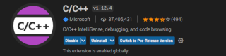

# [Using C++ on Linux in VS Code](https://code.visualstudio.com/docs/cpp/config-linux)

In this tutorial, you will configure Visual Studio Code to use the GCC C++ compiler (`g++`) and GDB debugger on Linux.

## Prerequisites

- C++ compiler
- C++ debugger
- C++ extension for VS Code

```bash
$ gcc --version
gcc (Debian 10.2.1-6) 10.2.1 20210110

$ gdb --version
GNU gdb (Debian 10.1-1.7) 10.1.90.20210103-git
```



As you go through the tutorial, you will create three files in a `.vscode` folder in the workspace:

- `tasks.json` (compiler build settings)
- `launch.json` (debugger settings)
- `c_cpp_properties.json` (compiler path and IntelliSense settings)

## The example code `hello.cpp`

```c++
#include <iostream>
#include <vector>
#include <string>

using namespace std;

int main()
{
    vector<string> msg {"Hello", "C++", "World"};

    for (const string& word : msg)
    {
        cout << word << " ";
    }
    cout << endl;
}
```

## Run `hello.cpp`

1. Open `hello.cpp` so that it is the active file.
2. From the drop-down next to the play button, select `Run C/C++ File`.
3. Choose `g++ build and debug active file` from the list of detected compilers on your system.

The first time you run your program, the C++ extension creates `tasks.json`, which you'll find in your project's `.vscode` folder. `tasks.json` stores build configurations.

```json
{
    "tasks": [
        {
            "type": "cppbuild",
            "label": "C/C++: g++ build active file",
            "command": "/usr/bin/g++",
            "args": [
                "-fdiagnostics-color=always",
                "-g",
                "${file}",
                "-o",
                "${fileDirname}/${fileBasenameNoExtension}"
            ],
            "options": {
                "cwd": "${fileDirname}"
            },
            "problemMatcher": [
                "$gcc"
            ],
            "group": {
                "kind": "build",
                "isDefault": true
            },
            "detail": "Task generated by Debugger."
        }
    ],
    "version": "2.0.0"
}
```

The `args` array specifies the command-line arguments that will be passed to `g++`, for example `"-std=c++20"`. 

This task tells g++ to take the active file (`${file}`), compile it, and create an executable file in the current directory (`${fileDirname}`) with the same name as the active file but without an extension (`${fileBasenameNoExtension}`), resulting in `hello` for our example.

- The `label` value is what you will see in the tasks list; you can name this whatever you like.
- The `detail` value is what you will as the description of the task in the tasks list. It's highly recommended to rename this value to differentiate it from similar tasks.

From now on, the play button will read from `tasks.json` to figure out how to build and run your program. You can define multiple build tasks in tasks.json, and whichever task is marked as the default will be used by the play button.

- You can modify your tasks.json to build multiple C++ files by using an argument like `"${workspaceFolder}/*.cpp"` instead of `${file}`.This will build all `.cpp` files in your current folder.
- You can also modify the output filename by replacing `"${fileDirname}/${fileBasenameNoExtension}"` with a hard-coded filename (for example `hello.out`).

## Debug `hello.cpp`

1. Go back to `hello.cpp` so that it is the active file.
2. Set a breakpoint by clicking on the editor margin.
3. From the drop-down next to the play button, select `Debug C/C++ File`.
4. If pompted, choose `C/C++: g++ build and debug active file` from the list of detected compilers on your system.

When you debug with the play button or F5, the C++ extension creates a dynamic debug configuration on the fly.

There are cases where you'd want to customize your debug configuration, such as specifying arguments to pass to the program at runtime. You can define custom debug configurations in a `launch.json` file.

To create `launch.json`, choose `Add Debug Configuration` from the `settings` button drop-down menu.

You'll then see a dropdown for various predefined debugging configurations. Choose `g++ build and debug active file`.

VS Code creates a `launch.json` file in the `.vscode` folder.

```json
{
    "configurations": [
        {
            "name": "C/C++: g++ build and debug active file",
            "type": "cppdbg",
            "request": "launch",
            "program": "${fileDirname}/${fileBasenameNoExtension}",
            "args": [],
            "stopAtEntry": false,
            "cwd": "${fileDirname}",
            "environment": [],
            "externalConsole": false,
            "MIMode": "gdb",
            "setupCommands": [
                {
                    "description": "Enable pretty-printing for gdb",
                    "text": "-enable-pretty-printing",
                    "ignoreFailures": true
                },
                {
                    "description": "Set Disassembly Flavor to Intel",
                    "text": "-gdb-set disassembly-flavor intel",
                    "ignoreFailures": true
                }
            ],
            "preLaunchTask": "C/C++: g++ build active file",
            "miDebuggerPath": "/usr/bin/gdb"
        }
    ],
    "version": "2.0.0"
}
```

Here it is set to the active file folder `${fileDirname}` and active filename without an extension `${fileBasenameNoExtension}`, which if `hello.cpp` is the active file will be `hello`.

The `args` property is an array of arguments to pass to the program at runtime.

Change the `stopAtEntry` value to `true` to cause the debugger to stop on the main method when you start debugging.

From now on, the play button and F5 will read from your `launch.json` file when launching your program for debugging.

## C/C++ configurations

If you want more control over the C/C++ extension, you can create a `c_cpp_properties.json` file, which will allow you to change settings such as the path to the compiler, include paths, C++ standard, and more.

You can create the file by running the command `C/C++: Edit Configurations (JSON)` from the Command Palette (Ctrl+Shift+P).

```json
{
    "configurations": [
        {
            "name": "Linux",
            "includePath": [
                "${workspaceFolder}/**"
            ],
            "defines": [],
            "compilerPath": "/usr/bin/gcc",
            "cStandard": "gnu17",
            "cppStandard": "gnu++14",
            "intelliSenseMode": "linux-gcc-arm64"
        }
    ],
    "version": 4
}
```

## [Configuration properties](https://code.visualstudio.com/docs/cpp/c-cpp-properties-schema-reference)

- `includePath`: An include path is a folder that contains header files (such as `#include "myHeaderFile.h"`) that are included in a source file. Specify a list of paths for the IntelliSense engine to use while searching for included header files. Searching on these paths is not recursive. Specify `**` to indicate recursive search. For example, `${workspaceFolder}/**` will search through all subdirectories while `${workspaceFolder}` will not.
- `cStandard`: The version of the C language standard to use for IntelliSense.
- `cppStandard`: The version of the C++ language standard to use for IntelliSense.


